# bruce-douyin(仿抖音短视频)

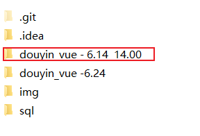

​         本项目从2024年6月左右开始写的（目前是2025年5月22日）一开始是提交到gitee，后面转到giehub，一开始也很少提交，只是光写代码，所以从github上面看，最早的提交记录是24年9月。记得当时刚学完前端还不太熟练，那时打算写一个项目练练手，因为作者本人非常爱刷抖音，于是就拿抖音来练手。当时也没想到，这个项目能坚持这么久，当时写的时候感觉写的非常爽，把学到的东西全都能用上。后面，我决定把我新学的东西，全部加到这个项目上面，经过这么久的整理和编写，这个项目正在不断完善，今天我回顾了一下这些年的提交记录，有感而发，写下此话。


====================================================================

2025.6.12 这几天比较闲  于是继续编写了一些页面   我记得有个按钮组件很熟悉  父组件传入参数从而控制子组件按钮的样式  很灵活很好用

这几天总算是把各种功能都串起来了   见识了很多新的技术   

后面想把直播间给搭建起来 问了下AI   接触到了一个agora-rtc-sdk-ng （搭建直播间用这个会很方便）

========================================================================================================================================

现在是2025年6月18日，这几天是毕业领证的几天，同时，我的仿抖音短视频APP大致的框架和基本的功能已经实现了，在今后的日子，我已经失去了学生的身份，从此成为了非常普通的社畜了，我不知道我这一年时间写的项目能对我日后有什么帮助，一切的一切只是在工位上的有感而发，才有了这段话。我也不知道我想写什么，只是想写一些东西。   哦，对了 我本来是想说，  之前的提交记录灭有什么逻辑，基本大部分提交消息都是乱写的，希望日后能把提交消息写好，希望日后的每一次提交都能给我自己带来收获。

=======================================================================================================================================

# 一些界面（全都是本人完成）

目前界面的数据来自与后台 没有整理数据 因此界面不是很好看

## 主界面


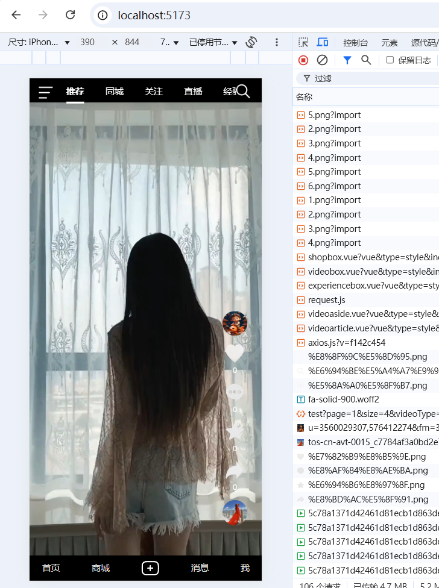


## 登录界面

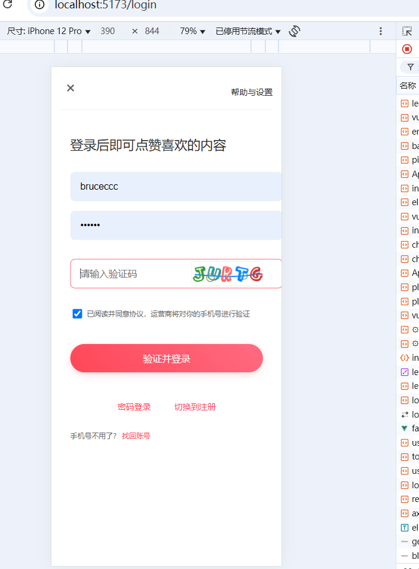

## 消息界面

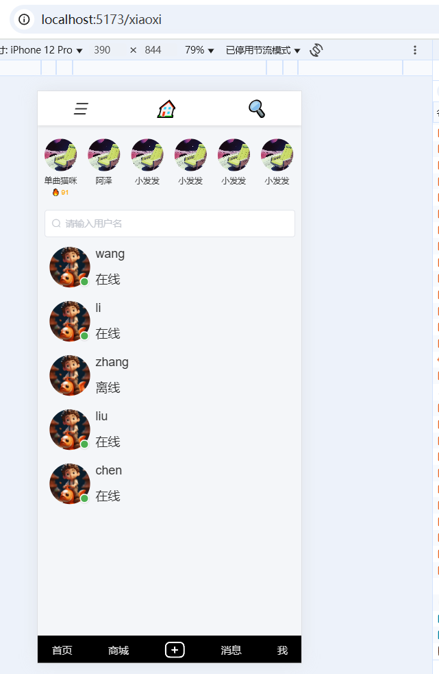

## 商城界面

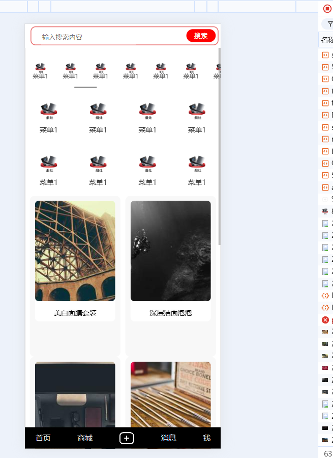

### 项目概述


 本项目为一款仿抖音的短视频社交平台，用户可上传、浏览、点赞、评论短视频，并支持音乐添加、商品购买等功能。平台融合了内容推荐、社交互动、电商变现等模块，构建完整的短视频生态体系，前后端分离开发，支持移动端和管理后台系统。

核心功能：

- 用户注册登录（含第三方授权）
- 视频上传、播放、点赞、评论、收藏
- 音乐库管理与音视频合成
- 好友关注与私信聊天
- 短视频推荐（基于用户行为的算法）
- 商品展示与下单支付
- 后台运营管理系统（用户、内容、商品、订单等）

### 业务说明

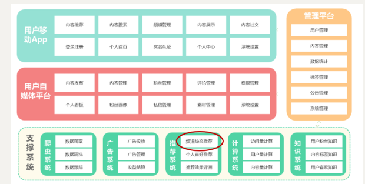

项目演示地址：

- 平台管理：暂无

- app端：暂无


技术栈

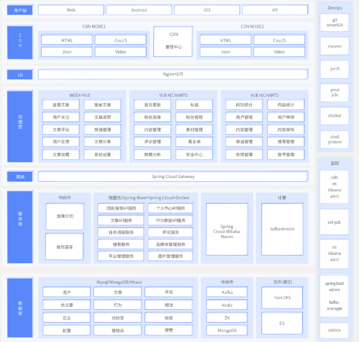

- Spring-Cloud-Gateway : 微服务之前架设的网关服务，实现服务注册中的API请求路由，以及控制流速控制和熔断处理都是常用的架构手段，而这些功能Gateway天然支持
- 运用Spring Boot快速开发框架，构建项目工程；并结合Spring Cloud全家桶技术，实现后端个人中心、自媒体、管理中心等微服务。
- 运用Spring Cloud Alibaba Nacos作为项目中的注册中心和配置中心
- 运用mybatis-plus作为持久层提升开发效率
- 运用Kafka完成内部系统消息通知；与客户端系统消息通知；以及实时数据计算
- 运用Redis缓存技术，实现热数据的计算，提升系统性能指标
- 使用Mysql存储用户数据，以保证上层数据查询的高性能
- 使用Mongo存储用户热数据，以保证用户热数据高扩展和高性能指标
- 使用FastDFS作为静态资源存储器，在其上实现热静态资源缓存、淘汰等功能
- 运用Hbase技术，存储系统中的冷数据，保证系统数据的可靠性
- 运用ES搜索技术，对冷数据、文章数据建立索引，以保证冷数据、文章查询性能
- 运用AI技术，来完成系统自动化功能，以提升效率及节省成本。比如实名认证自动化
- PMD&P3C : 静态代码扫描工具，在项目中扫描项目代码，检查异常点、优化点、代码规范等，为开发团队提供规范统一，提升项目代码质量


nginx配置文件

```
worker_processes 1;

events {
    worker_connections 1024;
}

http {
    include       mime.types;
    default_type  application/octet-stream;

    sendfile        on;
    keepalive_timeout  65;

    server {
        listen       80;
        server_name  localhost;

        # Serve static files from the dist folder
        location / {
            root   /usr/share/nginx/html/dist;  # Path to your dist folder
            index  index.html index.htm;
            try_files $uri $uri/ /index.html;  # Ensure SPA routing works correctly
        }

        # Proxy API requests
        location /api/ {
            rewrite ^/api/(.*)$ /$1 break;  # 去掉 /api 前缀
            proxy_pass http://localhost:9430;  # 代理到后端服务
            proxy_set_header Host $host;
            proxy_set_header X-Real-IP $remote_addr;
            proxy_set_header X-Forwarded-For $proxy_add_x_forwarded_for;
            proxy_set_header X-Forwarded-Proto $scheme;
        }


   # MinIO 反向代理（转发到 localhost:9000，去掉 /minio 前缀）
        location /minio/ {
            rewrite ^/minio(/.*)$ $1 break;
            proxy_pass http://localhost:9000;
            proxy_set_header Host $host;
            proxy_set_header X-Real-IP $remote_addr;
            proxy_set_header X-Forwarded-For $proxy_add_x_forwarded_for;
            proxy_set_header X-Forwarded-Proto $scheme;
        }


        # WebSocket proxy if needed
        # location /websocket/ {
        #     proxy_pass http://localhost:9998/ws;  # Adjust to your WebSocket server
        #     proxy_set_header Host $host;
        #     proxy_set_header X-Real-IP $remote_addr;
        #     proxy_set_header X-Forwarded-For $proxy_add_x_forwarded_for;
        #     proxy_set_header X-Forwarded-Proto $scheme;
        #     proxy_http_version 1.1;
        #     proxy_set_header Upgrade $http_upgrade;
        #     proxy_set_header Connection 'upgrade';
        # }

        # Error pages
        error_page   500 502 503 504  /50x.html;
        location = /50x.html {
            root   /usr/share/nginx/html;
        }
    }
}

```


本项目提供了内网穿透的脚本 可以通过norok把此项目部署到公网

```
authtoken: 2tq5jqicVNr4qf98hw6JJl7bWxI_2AmunBhWZcpGxiB9cZJoM
version: "2"
tunnels:
  frontend:
    proto: http
    addr: 8011
    domain: intense-lucky-possum.ngrok-free.app
  backend:
    proto: http
    addr: 8080
  fileendpoint:
    proto: http
    addr: 9000


#运行命令 ngrok start --all

```

服务器拉取代码时用这个强制覆盖  服务端一般不改代码

```
# 清除本地所有未提交的改动（已追踪文件和未追踪文件都会删除）
git reset --hard HEAD
git clean -fd

# 强制拉取远程 main 分支并覆盖本地
git fetch origin
git reset --hard origin/main

```


前端通过https访问（这样拍摄界面才能够正确访问摄像头）

1.通过mkcert生成本地密钥

2.vite.config.js指定密钥

```
  const httpsOptions = {
    key: fs.readFileSync(
      'C:/Users/Administrator/Desktop/tools/127.0.0.1+4-key.pem'
    ),
    cert: fs.readFileSync(
      'C:/Users/Administrator/Desktop/tools/127.0.0.1+4.pem'
    )
  }; 
  server: {
        host: true,
        https: httpsOptions, // 开启 https，使用证书
        }
```


对于无限滑动模块，最好在父组件里面把数据查出来，然后再显示，如果是在子组件里面查，容易卡顿，可能是vue的设计缺陷


一键部署（centos）

本项目提供了一键部署的shell脚本 bruce_douyin_start.sh  打包的时候切记先打basic包

```
#!/bin/bash

# 设置脚本执行失败时立即退出
set -e

echo "==================== 开始执行部署脚本 ===================="

# 1. **检查并拉取最新代码**
if command -v git &> /dev/null; then
    echo "git 已安装，正在从远程仓库获取最新代码..."

    # 检查是否有未提交的修改
    if ! git diff --quiet || ! git diff --staged --quiet; then
        echo "检测到未提交的本地修改，先进行 stash 处理..."
        git stash
        git pull origin main
        git stash pop
    else
        git pull origin main
    fi

    if [ $? -eq 0 ]; then
        echo "最新代码获取成功!"
    else
        echo "从远程仓库获取代码时出错!"
        exit 1
    fi
else
    echo "git 未安装，跳过更新代码步骤!"
fi

## 2. **执行 mvn install**
#echo "开始执行 mvn install..."
#mvn install
#
#if [ $? -eq 0 ]; then
#    echo "mvn install 执行成功!"
#else
#    echo "mvn install 执行失败!"
#    exit 1
#fi
# 2. **先 install douyin_basic 模块**
echo "先安装基础模块 douyin_basic ..."
cd douyin_basic || { echo "无法进入 douyin_basic 模块目录"; exit 1; }

mvn install
if [ $? -eq 0 ]; then
    echo "douyin_basic 安装成功!"
else
    echo "douyin_basic 安装失败!"
    exit 1
fi
# 3. **进入 JAR 文件夹**
cd jar || { echo "无法进入 JAR 文件夹"; exit 1; }

# 4. **检查并启动 Redis**
echo "正在检查 Redis 是否运行..."
if command -v redis-cli &> /dev/null; then
    if redis-cli ping | grep -q "PONG"; then
        echo "Redis 已经在运行!"
    else
        echo "Redis 未运行，尝试启动..."
        if systemctl list-units --type=service | grep -q "redis"; then
            sudo systemctl start redis
            if redis-cli ping | grep -q "PONG"; then
                echo "Redis 启动成功!"
            else
                echo "Redis 启动失败! 请手动检查。"
                exit 1
            fi
        else
            echo "Redis 未安装，请先安装 Redis!"
            exit 1
        fi
    fi
else
    echo "Redis 未安装，请先安装 Redis!"
    exit 1
fi

# 5. **关闭所有包含 'douyin' 和 '.jar' 的进程**
echo "正在关闭所有包含 'douyin' 和 '.jar' 字符串的进程..."
PIDS=$(ps aux | grep 'douyin.*\.jar' | grep -v 'grep' | awk '{print $2}')

if [ -n "$PIDS" ]; then
    echo "检测到正在运行的 douyin 相关进程: $PIDS"
    echo "$PIDS" | xargs kill -9
    echo "进程已关闭!"
else
    echo "没有找到相关进程，无需关闭!"
fi

# 6. **启动所有 JAR 文件**
for jar_file in *.jar; do
    if [ -f "$jar_file" ]; then
        echo "正在启动 $jar_file ..."
        nohup java -Xms256m -Xmx512m -jar "$jar_file" --spring.profiles.active=dev > "$jar_file.log" 2>&1 &
        echo "$jar_file 启动成功!"
    fi
done

echo "所有 JAR 文件已启动!"

# 返回上级目录
cd ..

# 7. **进入 Vue 项目目录**
cd douyin_vue2 || { echo "无法进入 Vue 项目文件夹"; exit 1; }

# 8. **安装 npm 依赖**
echo "开始执行 npm install..."
npm install

if [ $? -eq 0 ]; then
    echo "npm install 执行成功!"
else
    echo "npm install 执行失败!"
    exit 1
fi

# 9. **执行 Vue 项目构建**
echo "开始执行 npm run build..."
npm run build

if [ $? -eq 0 ]; then
    echo "npm build 执行成功!"
else
    echo "npm build 执行失败!"
    exit 1
fi

# 10. **重启 Nginx**
echo "正在重启 Nginx..."
sudo systemctl restart nginx

if [ $? -eq 0 ]; then
    echo "Nginx 重启成功!"
else
    echo "Nginx 重启失败!"
    exit 1
fi

echo "==================== 部署脚本执行完成! ===================="

```


# websocket

本项目基于websocket实现了实时聊天、实时弹幕、实时通知

## 实时聊天

```
package com.bruce.config;

import com.bruce.handler.UserHandshakeHandler;
import com.bruce.handler.UserHandshakeInterceptor;
import org.springframework.context.annotation.Configuration;
import org.springframework.messaging.simp.config.MessageBrokerRegistry;
import org.springframework.web.socket.config.annotation.*;

@Configuration
@EnableWebSocketMessageBroker
public class WebSocketConfig implements WebSocketMessageBrokerConfigurer {

    @Override
    public void configureMessageBroker(MessageBrokerRegistry registry) {
        // 开启两个broker：一个是群聊用的 /topic，一个是一对一用的 /queue
        registry.enableSimpleBroker("/topic", "/queue");

        // 应用前缀，客户端发送消息的路径要以 /app 开头
        registry.setApplicationDestinationPrefixes("/app");

        // 点对点时必须配置
        registry.setUserDestinationPrefix("/user");
    }


    @Override
    public void registerStompEndpoints(StompEndpointRegistry registry) {
        registry.addEndpoint("/user/ws") // 客户端连接的端点
                .setHandshakeHandler(new UserHandshakeHandler())   // 使用自定义 HandshakeHandler
                .addInterceptors(new UserHandshakeInterceptor()) // 绑定用户身份
                .setAllowedOrigins("*")
                .withSockJS();
    }
}

```


## 实时弹幕

```
package com.bruce.config;

import com.bruce.handler.WebSocketHandler;
import org.springframework.context.annotation.Configuration;
import org.springframework.web.socket.config.annotation.EnableWebSocket;
import org.springframework.web.socket.config.annotation.WebSocketConfigurer;
import org.springframework.web.socket.config.annotation.WebSocketHandlerRegistry;

// @Configuration 注解表示该类是一个配置类
@Configuration
// @EnableWebSocket 注解启用 WebSocket 配置
@EnableWebSocket
public class WebSocketConfig implements WebSocketConfigurer {

    // 重写 registerWebSocketHandlers 方法来注册 WebSocket 处理器
    @Override
    public void registerWebSocketHandlers(WebSocketHandlerRegistry registry) {
        // 将 WebSocket 请求路径设置为 "/video/ws"，以便匹配前端的 WebSocket 请求路径
        registry.addHandler(new WebSocketHandler(), "/video/ws")
                // setAllowedOrigins("*") 设置允许的跨域请求来源，这里设置为 "*" 表示允许所有来源
                .setAllowedOrigins("*");
    }
}

```


## 实时通知

```
package com.bruce.config;

import com.bruce.handler.WebSocketNoteHandler;
import org.springframework.context.annotation.Configuration;
import org.springframework.web.socket.TextMessage;
import org.springframework.web.socket.WebSocketSession;
import org.springframework.web.socket.config.annotation.EnableWebSocket;
import org.springframework.web.socket.config.annotation.WebSocketConfigurer;
import org.springframework.web.socket.config.annotation.WebSocketHandlerRegistry;
import org.springframework.web.socket.handler.TextWebSocketHandler;

@Configuration
@EnableWebSocket
public class WebSocketNoteConfig implements WebSocketConfigurer {
    @Override
    public void registerWebSocketHandlers(WebSocketHandlerRegistry registry) {
        registry.addHandler(new WebSocketNoteHandler(), "/user/wsnote")
                .setAllowedOrigins("*");
    }
}


```


## 初始工程搭建

### 环境准备

①：项目依赖环境

- JDK1.8

- Intellij Idea

- maven-3.6.1

- Git


### 主体结构

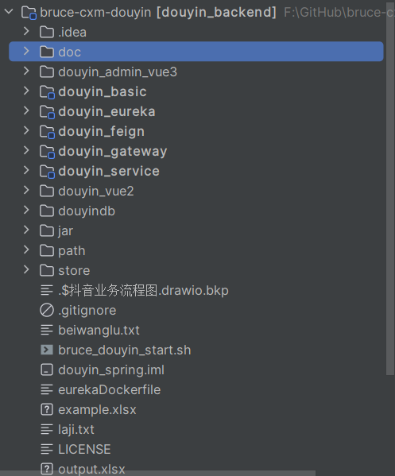


## 登录

### 需求分析

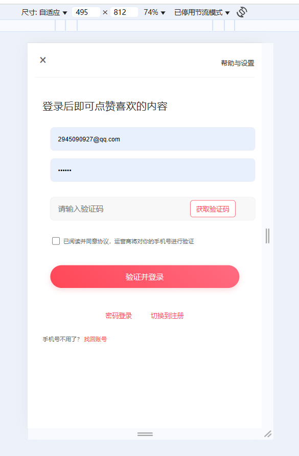

- 用户点击**开始使用**

  登录后的用户权限较大，可以查看，也可以操作（点赞，关注，评论）

- 用户点击**不登录，先看看**

​       游客只有查看的权限


项目中的持久层使用的mybatis-plus，一般都使用mybais-plus逆向生成对应的实体类

手动加密（md5+随机字符串）

md5是不可逆加密，md5相同的密码每次加密都一样，不太安全。在md5的基础上手动加盐（salt）处理

注册->生成盐

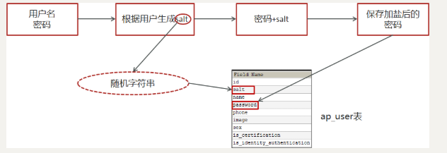

登录->使用盐来配合验证

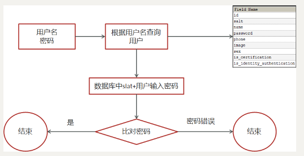


### 思路分析


1，用户输入了用户名和密码进行登录，校验成功后返回jwt(基于当前用户的id生成)

2，用户游客登录，生成jwt返回(基于默认值0生成)‘


### 全局过滤器实现jwt校验

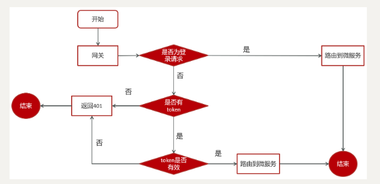

思路分析：

1. 用户进入网关开始登陆，网关过滤器进行判断，如果是登录，则路由到后台管理微服务进行登录
2. 用户登录成功，后台管理微服务签发JWT TOKEN信息返回给用户
3. 用户再次进入网关开始访问，网关过滤器接收用户携带的TOKEN 
4. 网关过滤器解析TOKEN ，判断是否有权限，如果有，则放行，如果没有则返回未认证错误


